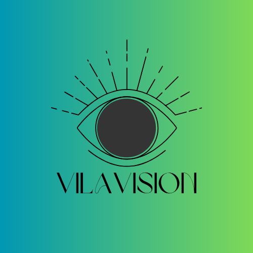

<!-- VILAVISION README.md -->

<p align="center">
  
</p>

<h1 align="center">🧠 VilaVision – Advancing AI for a Better Future</h1>

<p align="center">
  <strong>Empowering innovation with human-centric, scalable, and explainable Artificial Intelligence.</strong>
</p>

---

## 🌐 About Us

> VilaVision is an AI-driven organization devoted to solving complex real-world problems using intelligent, ethical, and scalable machine learning and deep learning solutions.

From cutting-edge **computer vision** to next-generation **language models**, we build systems that **see, learn, understand**, and **create**—pushing the boundaries of what AI can achieve.

Our mission is structured around the **golden ratio** of technological innovation:
- **0.618** – Thoughtful Research & Design
- **0.382** – Scalable Real-World Deployment

---

## 🧭 Our Philosophy: *Designing in Harmony with Nature*

At VilaVision, we believe technology should evolve in balance with human needs and natural aesthetics. The **golden ratio (1.618)** guides our product design and architecture—from UI/UX to neural network structuring—delivering harmony, elegance, and clarity.

> “A good AI system doesn’t just work—it feels right.”

---

## 🔭 What We’re Working On

| Project                     | Description                                                                 | Stack                            |
|----------------------------|-----------------------------------------------------------------------------|----------------------------------|
| 🖼️ AI Vision Lab            | High-performance image & video analysis using VLM, OpenCV, Transformers     | PyTorch, OpenAI, Hugging Face    |
| 🗣️ SoulTalk NLP             | Conversational AI that understands empathy and emotional tone              | LangChain, GPT, Mistral          |
| 📈 AI for Finance           | Smart investment tools & risk models for financial empowerment              | Python, Streamlit, LLMs          |
| 🧬 HealthNet AI             | Models for predicting health outcomes and aiding diagnosis                  | CNNs, Medical Datasets, FastAPI  |

---

## 🚀 How to Use Our Projects

### Clone Any Repo:
```bash
git clone https://github.com/VilaVision/<project-name>.git
cd <project-name>
````

### Setup:

Each project contains a `README.md` with setup instructions, dependencies, and deployment steps. Most repos follow this structure:

* `requirements.txt` or `environment.yml`
* `/models`, `/notebooks`, `/src`
* `Dockerfile` (for containerized use)

---

## 🧠 AI Research & Community

We are passionate contributors to the global AI community and open research. Our areas of exploration:

* 🌌 Multimodal AI (Vision+Language)
* 🧬 AI in Healthcare
* 💸 Financial Data Mining
* 🌍 Responsible AI & Explainability

---

## 🧱 Tech Stack

```text
🧠 Deep Learning    → PyTorch, TensorFlow, Transformers
🌐 Backend          → FastAPI, Flask, Node.js
🎨 Frontend         → React.js, Tailwind CSS, Three.js
🛠️ DevOps          → Docker, GitHub Actions, Azure, GCP
📊 Visualization    → Plotly, Streamlit, Matplotlib
```

---

## 📚 Learn & Grow

🧾 We believe in **open learning**. Soon, we’ll launch:

* 🎓 Free AI Courses
* 📘 Open Research Papers
* 💡 AI Design Thinking Frameworks
* 🛠️ Tools for Developers & Students

---

## 🤝 Join Us / Collaborate

We’re always looking for passionate researchers, developers, and contributors.

* 👨‍💻 Collaborate with us: [GitHub Issues](https://github.com/VilaVision)
* 🧠 Join our research group (coming soon)
* 🌐 Website: Coming soon
* 💬 LinkedIn, Twitter, Discord (links to be added)

---

## 🌟 Vision for the Future

Imagine a world where AI:

* Respects privacy 🌐
* Enhances creativity 🎨
* Improves lives 🩺
* Operates transparently 🪟
* Reflects human values 🧭

That's what we aim to build at **VilaVision**.

---

## 📩 Contact

📫 For project proposals, research partnerships, or joining the team, contact us at:
**📧 [vilavision.ai@gmail.com](mailto:vilavision.ai@gmail.com)** *(replace with your org email if available)*

---


