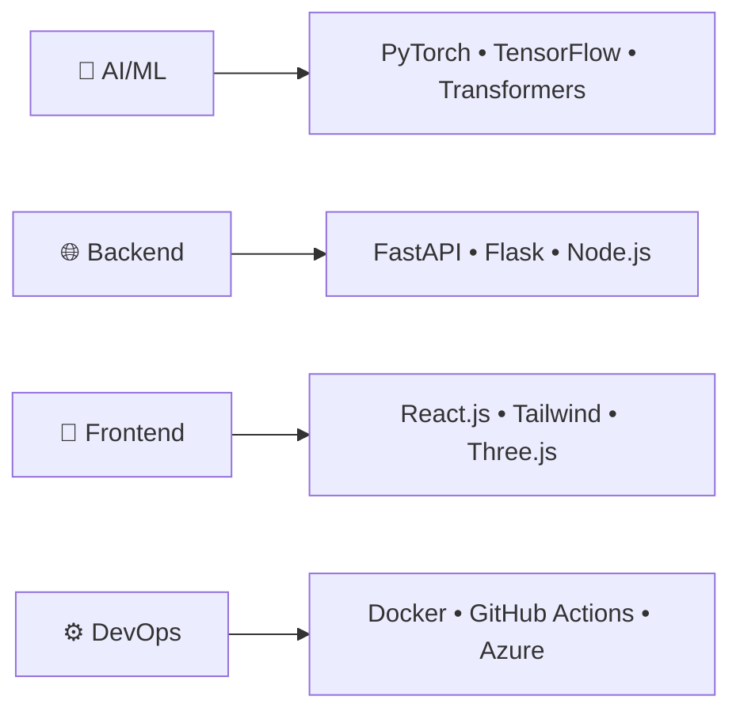

# VilaVision

<div align="center">


# 🚀 **VilaVision**
### *Advancing AI for a Better Future*

**Empowering innovation with human-centric, scalable, and explainable AI**

[](mailto:vilavision.ai@gmail.com)
[](mailto:vilavision.ai@gmail.com)
[](https://github.com/VilaVision)

</div>

---

---

## 🎯 **What We Do**

<div align="center">

**Building AI systems that see, learn, understand, and create**

</div>

We solve complex real-world problems through intelligent, ethical, and scalable machine learning solutions while maintaining human values at our core.

### 🧠 **Our Approach**
```
🔬 Research & Design    ████████████████████░░░░░░░░ 61.8%
🚀 Real-World Deployment ███████████░░░░░░░░░░░░░░░░░ 38.2%
```

> *"A good AI system doesn't just work—it feels right."*

## 🔬 **Research Focus**

<div align="center">

| 🌌 **Multimodal AI** | 🩺 **Healthcare AI** | 💰 **Financial Intelligence** | 🔍 **Explainable AI** |
|:---:|:---:|:---:|:---:|
| Vision + Language | Predictive Health Models | Smart Investment Tools | Transparent Systems |

</div>

## 🚀 **Projects**

<div align="center">

| **Project** | **Description** | **Tech Stack** | **Status** |
|:------------|:----------------|:----------------|:-----------|
| 🖼️ **AI Vision Lab** | High-performance image & video analysis | `PyTorch` `OpenAI` `Transformers` | 🟢 **Active** |
| 🗣️ **SoulTalk NLP** | Emotionally-aware conversational AI | `LangChain` `GPT` `Mistral` | 🟢 **Active** |
| 📈 **FinanceAI** | Intelligent investment & risk tools | `Python` `Streamlit` `LLMs` | 🟡 **Beta** |
| 🧬 **HealthNet AI** | Medical diagnosis assistance | `CNNs` `FastAPI` `Medical Data` | 🔵 **Research** |

</div>

## 🛠️ **Tech Stack**

<div align="center">



</div>  

## 🚀 **Quick Start**

<div align="center">

**Get up and running in 3 simple steps**

</div>

### 📋 **Prerequisites**
- Python 3.8+ • Git • Docker (optional)

### ⚡ **Installation**

```bash
# 1️⃣ Clone any repository
git clone https://github.com/VilaVision/<project-name>.git
cd <project-name>

# 2️⃣ Install dependencies
pip install -r requirements.txt

# 3️⃣ Run the project
python main.py
```

> 💡 Each project includes detailed setup instructions in its README

## 📚 Learning Resources

Coming Soon:
- 🎓 **Free AI Courses** - Comprehensive learning paths
- 📘 **Research Papers** - Open-source publications
- 💡 **Design Frameworks** - AI thinking methodologies
- 🛠️ **Developer Tools** - Utilities for AI development

## 🤝 **Contributing**

<div align="center">

**Join our mission to advance AI for humanity**

[](#)
[](#)

</div>

### 🌟 **Ways to Contribute**

| Type | Description |
|:-----|:------------|
| 🐛 **Bug Reports** | Help us improve by reporting issues |
| 💡 **Feature Ideas** | Suggest new capabilities and improvements |
| 🔧 **Code** | Submit pull requests and improvements |
| 📖 **Documentation** | Enhance guides and tutorials |

### 🔄 **Simple Process**
```
Fork → Branch → Code → Commit → Push → Pull Request
```

## 🌍 **Our Vision**

<div align="center">

**Building AI that serves humanity**

</div>

| 🔒 **Privacy First** | 🎨 **Creative Enhancement** | 🩺 **Life Improvement** | 🪟 **Transparency** | 🧭 **Human Values** |
|:---:|:---:|:---:|:---:|:---:|
| Protects user rights | Amplifies potential | Solves real problems | Explainable decisions | Ethical development |

---

## 📬 **Let's Connect**

<div align="center">

**Ready to shape the future of AI together?**

[](mailto:vilavision.ai@gmail.com)

**Perfect for:** Partnerships • Business • Careers • Academic Collaboration

</div>

---

<div align="center">

*Building AI that serves humanity • Designed with the golden ratio in mind*

**Made with ❤️ by the VilaVision Team**

⭐ **Star us on GitHub** • 🍴 **Fork our projects** • 📢 **Spread the word**

</div>
